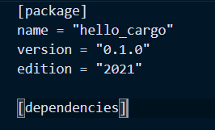

## 初识Rust

### 安装

查询本地文档

```c++
rustup doc 
```

更新Rust

```
rustup update
```

卸装

```c++
rustup self uninstall
```


### 编译与运行Rust程序

编译：

```c++
rustc main.rs
```

运行:

```c++
.\main.exe
```


### Rust程序解剖

- 定义函数：fn main(){}
  - 没有参数，没有返回
- main函数很特别：每个Rust可执行程序最先运行的艾玛
- 打印文本：println!("Hello World");
  - Rust的缩进是4个空格，不是tab
  - println!是一个Rust宏，即有！结尾
  - 每行代码以 ; 结束


### 编译和运行是单独的两步

- 运行Rust程序需要先编译
- 编译成功后，会生成一个二进制文件
  - 在Windows上为.pdb文件，里面包含调试信息
- Rust是预先编译的语言
  - 可以先编译程序，然后将可执行文件交给别人运行
- rustc 只适用于简单的Rust程序


## Cargo

- Cargo是Rust的构建系统和包管理工具。
  - 构建代码、下载依赖的库
- 安装Rust自动安装Cargo
  - 验证：cargo --version


### 使用Cargo创建项目

- 创建项目cargo new hello_cargo

- Cargo.toml

  - TOML是Cargo的配置格式

  - [package]，是一个区域标题，表示下方内容用来配置包(package)的信息

    

  - [dependencies]，是另一个区域的开始，它会列出项目的依赖项

  - 在Rust里面，代码的包被称为crate

​		

### 构建Cargo项目

```c++
cargo build
```

- cargo build
  - 可执行文件的路径：target\debug\hello_cargo.exe
- 运行项目：自行运行
- 第一次运行cargo build会在顶层目录生成cargo.lock 文件
  - 该文件负责追踪项目依赖的精确版本
  - 不需要手动修改该文件


### 构建和运行cargo项目

```c++
cargo run
```

- cargo run：编译代码+执行程序。
  - 如果之前编译成功过，并且源码没有改变，那么会直接运行二进制文件。


### cargo check

- 检查代码，确保通过编译，但不会产生任何可执行文件
- cargo check 比 cargo build快得多
  - 编写代码时可以使用连续反复的使用cargo check检查代码，提高效率


### 为发布构建

- cargo build --release

  - 编译时会进行优化：代码运行更快，但编译时间更长
  - 会在target/release而不是 target/debug生成可执行文件

  


