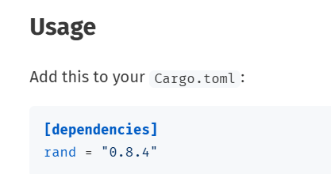

## 猜数游戏

### 输入与输出

```rust
// 如果需要使用prelude(预导入的模块)之外的包，需要使用use来导入。
use std::io;

fn main() {
    
    println!("猜数游戏!");

    println!("请输入你猜的数:");
	// 使用let来声明变量。变量默认不可变，使用mut修饰来表示该变量可变。
    // String字符串类，相当于C++的静态方法使用
    let mut guess = String::new();
	
    // 调用io下的函数读取一行，
    // 传参:使用引用&，并使用mut表面是可变的。
    
    // #[stable(feature = "rust1", since = "1.0.0")]
    // pub fn read_line(&self, buf: &mut String) -> io::Result<usize> {
    //    self.lock().read_line(buf)
    // }
    // read_line函数返回Result,一个枚举类型，如Ok和Err
    // 使用expect来处理异常，未处理则会编译警告。
 
    io::stdin().read_line(&mut guess)
    .expect("无法读取行");
	// 花括号为占位符,按顺序填充变量值
    println!("你猜的数是: {}", guess);
}

```


### 获取随机数

crates的官网：https://crates.io/

使用rand的方法：


```rust
// 了解：引用rand库的Rng trait，用于后续随机数的生成
use rand::Rng; // trait
// 创建一个与当前线程相关的随机数生成器，然后利用该生成器生成[1,101)之间的随机数
let secret_number = rand::thread_rng().gen_range(1..101);
println!("秘密数字是: {}", secret_number);
```


### 比较大小

```rust
// Ordering含有三个枚举量，Less、Greater、Equal
use std::cmp::Ordering;

// 如果没有后续的match代码，该变量默认是i32类型，但有match后，编译器会将该变量在编译时确定为u32的类型，与下文显示定义的类型相同。
let secret_number = rand::thread_rng().gen_range(1..101);

// shadow隐藏机制，即可以重复定义变量guess，使用 :u32 来显示指定变量类型
// guess:String的trim方法，将两边的空格去除
// parse方法根据接受变量的类型进行转变
// parse方法返回Result类型变量，还有Ok和Err，用expect来处理。
let guess:u32 = guess.trim().parse().expect("请输入数字");

// 可以简单理解为switch语句，guess和secret_number的比较返回的类型为Ordering，含有三个枚举量，通过匹配，执行相应的语句。
match guess.cmp(&secret_number){
	Ordering::Less=> println!("太小了"),
	Ordering::Greater=> println!("太大了"),
	Ordering::Equal=> println!("猜对了"),
}
```


### 多次猜测

```rust
// 使用loop来表示{}内的代码会循环执行，可以使用continue和break
loop{
	println!("请输入你猜的数:");
	let mut guess = String::new();
	io::stdin().read_line(&mut guess).expect("无法读取行");  
	// 老版本：当输入字母时，程序会崩溃
	// let guess:u32 = guess.trim().parse().expect("请输入数字");
    
    // 使用match来处理，如果读取是数字，则返回，不是则跳到下一次循环。
	let guess:u32 = match guess.trim().parse(){
		Ok(num) => num, // num应该指代guess.trim().parse()返回的值
		Err(_) => { // _表示占位符，不想使用msg信息等变量
			println!("输入错误，请输入数字！！！");
			continue;// 跳过当前循环，进入下一次循环
		},
	};
	println!("你猜的数是: {}", guess);
	match guess.cmp(&secret_number){
		Ordering::Less=> println!("太小了"),
		Ordering::Greater=> println!("太大了"),
		Ordering::Equal=> {
			println!("猜对了");
			break;// 退出程序
		} 
	}
}
```


### 完整版

```rust
use std::io;
use rand::Rng; // trait
use std::cmp::Ordering;

fn main() {

    let secret_number = rand::thread_rng().gen_range(1..101);
    // println!("秘密数字是: {}", secret_number);
    
    println!("猜数游戏!");

    loop{
        println!("请输入你猜的数:");

        let mut guess = String::new();
    
        io::stdin().read_line(&mut guess)
        .expect("无法读取行");
        
        // 老版本：当输入字母时，程序会崩溃
        // let guess:u32 = guess.trim().parse().expect("请输入数字");
        let guess:u32 = match guess.trim().parse(){
            Ok(num) => num,
            Err(_) => {
                println!("输入错误，请输入数字！！！");
                continue;
            },
        };
    
        println!("你猜的数是: {}", guess);
 
        match guess.cmp(&secret_number){
            Ordering::Less=> println!("太小了"),
            Ordering::Greater=> println!("太大了"),
            Ordering::Equal=> {
                println!("猜对了");
                break;
            } 
        }
    }
}
```

