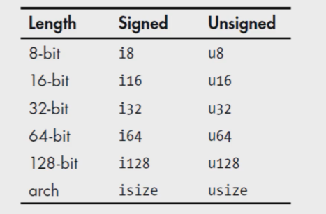
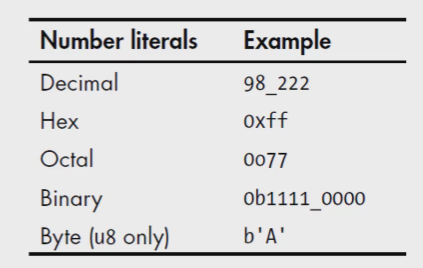
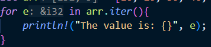

## 1、变量与可变性

- 申明变量使用let关键字
- 默认情况，变量不可变
- 使用mut关键字修饰，变量即可改变


### 变量与常量

- 常量，绑定值以后也是不可变的，但与不可变的变量有一定区别：

  - 常量不可以使用mut，常量永远都是不可变的。
  - 常量使用const关键字声明，且必须标注类型。
  - 常量可以在任何作用域内进行申明，包括全局作用域。
  - 常量只可以绑定到常量表达式，无法绑定到函数的调用结果或只能在运行时才能计算出的值。

- 程序运行期间，常量在声明的作用域内一直有效。

- 命名规范：使用全大写字母，单词之间使用_分割。

- ```rust
  const MAX_LENTH:u32 = 100_000;
  ```


### Shadowing隐藏机制

- 可以使用相同的名字声明新的变量，新的变量会shadow隐藏之前的变量

- shadow和把变量标记为mut可变变量不一样：

  - 使用shadow机制时，必须使用let关键字来重新声明。不像mut一样，不需要再使用mut来修饰变量。

    ```rust
    let x1 = 3;
    let x2 = 5;
    
    let mut x3 = 3;
    x3 = 5;
    ```

  - 使用let声明的同名新变量，也是不可变的。

  - 新变量的类型可以不同。

    ```rust
    let x = "123";
    let x = x.len();
    ```

    

## 2、数据类型

- 标量和复合类型
- Rust时静态编译语言，在编译时必须知道所有变量的类型
  - 基于使用的值，编译器通常可以推断出具体类型。
  - 如果可能的类型比较多(如将String转为整数的parse方法)，就必须添加类型的标注，否则编译会报错。


### 标量类型

- 一个标量类型代表一个单个的值
- Rust有四个主要的标量类型：
  - 整数类型
  - 浮点类型
  - 布尔类型
  - 字符类型


#### 整数类型

- 使用 [i/u] 位数，来表示整数的类型。如i32表示有符号32位。

  

- isize和usize类型：

  - 位数由程序运行的计算机的架构决定。
  - 常用于集合进行索引操作。

- 整数字面值：

  - 除byte类型外，所有数值字面值都允许使用类型后缀。如57u8

  - 不想指定，使用Rust提供的默认类型即可。

  - 整数的默认类型是i32。

  - 一些字面值的表达：

    

- 整数溢出：

  - 调试模式下编译：Rust会检查整数溢出，如果溢出，程序运行时会发生panic恐慌。
  - 发布模式下(--release)编译：Rust不会检查panic。当发生溢出时，Rust会执行''环绕''操作(理解与取模运算，始终不会溢出)，不会发生panic。


#### 浮点类型

- Rust有两种基础的浮点类型，即含有小数的类型。
  - f32，32位，单精度
  - f64，64位，双精度
- Rust的浮点类型使用IEEE-754标准来表述。
- f64时默认类型，因为现代CPU上f64和f32的速度差不多，且精度更高。


#### 数值运算

- 上述类型支持常规语言的运算。


#### 布尔类型

- Rust的布尔类型有两个值：true和flase。
- 一个字节大小
- 符号为bool


#### 字符类型

- Rust语言中char类型被用来描述语言中最基础的单个字符。
- 字符类型的字面值使用单引号。
- 占用4字节大小
- 时Unicode标量值，比ASCII表示更多的字符。
  - U+000到U+D7FF
  - U+E000到U+10FFFF


### 复合类型

#### Tuple

- Tuple可以将多个类型的多个值放在一个类型里。
- 长度固定，一旦声明就无法改变。
- 可以简单理解为Python的元组


##### 创建Tuple

- 在小括号里，值用逗号分开

- tuple的各值的类型可以不同

  ```rust
  let tup = (1,2,3);
  let tup: (i64, f64) = (44, 22.32);// 显示指定类型    
  ```

##### 获取tuple的元素值

- 可以使用模式匹配来解构tuple，来获取元素的值

  ```rust
  let (x,y )= tup;
  println!("元组：{} {}",x,y);
  ```

##### 访问tuple的元素

- 使用点标记发，后接元素的索引号

```rust
println!("元组：{} {}",tup.0,tup.1);
```


#### 数组

- 即常见的数组。

- 数据存放在栈上，而不是堆。

- 存在C++中的Vector，由标准库提供，长度可以改变，默认使用Vector。

- 数据的类型：[ 类型; 长度 ]

  ```rust
  let a:[i32;5] = [1,2,3,4,5];
  ```

- 指定初始值来声明数组：[ 初始值 ; 长度 ]

  ```rust
  let a = [3;4];
  ```

- 访问元素，[索引值]。

  - 索引值越界时，编译可能会通过，运行时一定会报错，Rust不允许继续访问数组外地址的内存。


## 3、函数

- 使用fn关键字

- 函数和变量名，Rust使用snake_case命名规范：所有字母小写，单词之间使用下划线_分开。

  ```rust
  fn function(){
      println!("函数");
  }
  ```

- 不同于C++和C，函数声明在main之后，也可以在main中调用。


### 函数的参数

- parameters，arguments：形参，实参。

- 函数签名里，必须声明参数的类型。

  ```rust
  fn function(x:i32){
      println!("传入的实参为：{}",x);
  }
  ```


### 函数体中的语句与表达式

- 函数体由一些列语句组成，可选择由一个表达式结束。即函数最后一个语句是表达式。

- Rust是一个基于表达式的语言。

- 表达式会计算并返回一个值。

- 语句不会返回值。

- 函数定义是语句。

- 语句不返回值，所以不能使用let将一个语句赋值给变量。

- 函数调用是表达式，函数定义是语句，所以函数定义不能用来赋值，但函数调用时返回的值可以用来赋值。

  ```rust
  let x = {
          println!("代码块");
          x+3 //  不使用分号;结尾，那么这是一个表达式，会作为代码块{}的返回值。
  };
  ```

  


### 函数的返回值

- 在 -> 符号后边声明函数返回值的类型，但是不可以为返回值命名

- 在Rust中，返回值一般是函数体最后一个表达式的值

- 若想提前返回，使用retrun关键字，指定一个值。

  ```rust
  fn if_nq_add_two(x:i32,y:i32)->i32{
      if( x == y ){
          return x
      }
      x+y
  }
  ```


## 4、控制流

### if表达式

- 常见的if，表达式可以不适用括号。

- 表达式返回值必须为bool类型，不同于C++会将其他类型自动转换为bool类型。

  ```rust
  let x = 3;
  if x > 3{
      println!("x is greater than 3");
  } else {
      println!("x is less than or equal to 3");
  }
  ```


### 循环

- 提供三种循环：loop、while、for


#### loop

- 反复执行一块代码，直到break。

  ```rust
  let mut cnt = 1;
  loop{
      println!("Hello, world!");
      if cnt == 5{
          break;
      }
      cnt += 1;
  }
  ```


#### while

```rust
let mut cnt = 1;
while cnt != 6{
    println!("Hello, world!");
    cnt += 1;
}
```


#### for

```rust
let arr = [10, 20, 30, 40, 50];
for e in arr.iter(){
    println!("The value is: {}", e);
}
```



e是数组元素的引用。

```rust
// 可配合Range遍历
for i in (1..4).rev(){
    println!("{}!", i);
}
```

